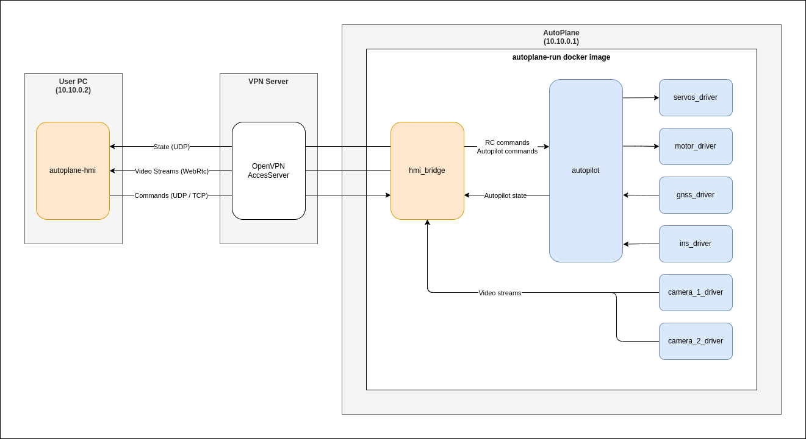

Software
========================

Architecture
------------------------

Build
------------------------

.. note::
    Before building, please follow the :doc:`../hardware/equipments_configuration/user_pc/index` steps

To build the Autoplane software, simply run the following : 

.. code-block::

    git clone https://github.com/AntoineDiers/Autoplane.git --recurse-submodules
    cd Autoplane/software
    ./build.sh

This will generate the following :

- **deploy/autoplane-hmi_*_amd64.deb** : The installer for the Autoplane HMI
- **deploy/autoplane-run.tar** : A tar file containing the autoplane-run docker image
- **deploy/docker-compose.yaml** : The docker-compose file that will start the docker image on the Autoplane's Raspberry PI
- The **autoplane-run** docker image that will run on the Autoplane's Raspberry PI

Deploy
------------------------

Deploy Autoplane HMI
________________________

.. code-block::

    sudo dpkg -i deploy/autoplane-hmi_*.deb

You can then run it with 

.. code-block::

    autoplane-hmi

Deploy Autoplane Firmware
________________________
    
- Copy the **docker-compose.yaml** file into your raspberry pi

.. code-block::

    scp deploy/docker-compose.yaml autoplane@autoplane_wifi:/home/autoplane

- Ssh into your raspberry_pi
- Pull the docker from your local registry

.. code-block::

    docker pull dev_pc:5000/autoplane-run
    docker tag dev_pc:5000/autoplane-run autoplane-run
 
- Start the autoplane software

.. code-block::

    cd && docker compose down && docker compose up -d
