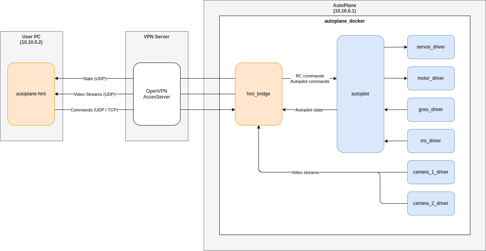

# Autoplane Software

## Software architecture



## System setup

The Autoplane software runs on three machines, each one of them require a specific setup :

- [User PC](./documentation/system_setup/user_pc.md) : Used for building the software and running the HMI
- [VPN Server](./documentation/system_setup/vpn_server.md) : Provides a VPN connection between the user and the Autoplane
- [Raspberry PI](./documentation/system_setup/raspberry_pi.md) : Runs the autoplane software

## Build

```bash
./build.sh
```

This script will generate : 
- A docker image called **autoplane** that contains the firmware that will run in the Autoplane Raspberry PI
- **autoplane-hmi_*.deb** : a Linux installer for the HMI 

