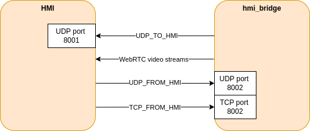

# hmi_bridge

This Rust node handles all communications between the Autoplane and the HMI 

All the data that transits between the HMI and the hmi_bridge (except the webrtc data obviously) is described in the [Message](../../../autoplane-hmi/autoplane_hmi_lib/src/lib.rs) enum of the **autoplane_hmi_lib** and is serialised as json

### Parameters

| Name          | Description
|---------------|------------------
| hmi_ip        | The IP address of the HMI

### Topics

##### Subscriptions

| Name          | Type              | Description
|---------------|-------------------|-------------------------
| ~/roll        | std_msgs/Float64  | The roll of the plane
| ~/pitch       | std_msgs/Float64  | The pitch of the plane